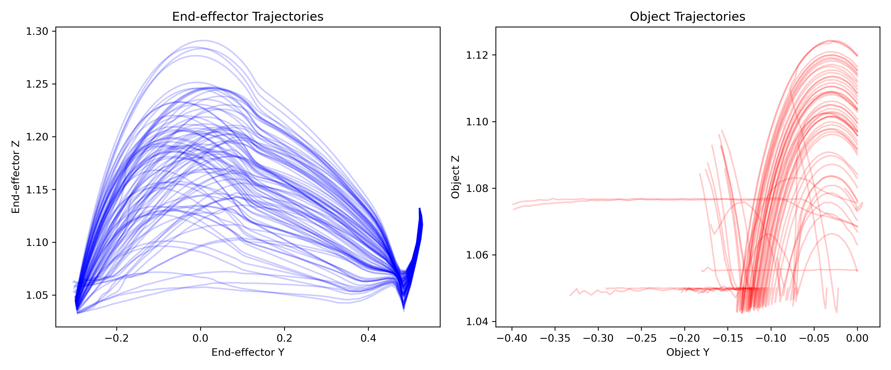
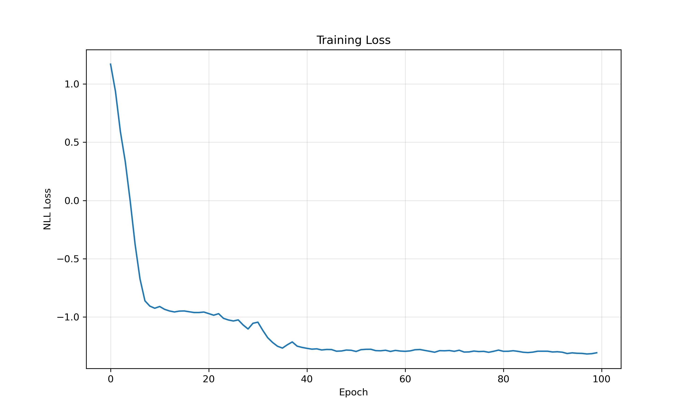
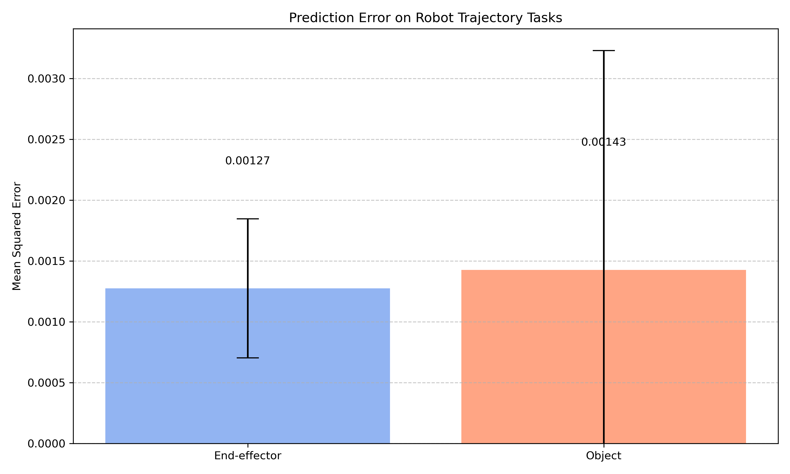
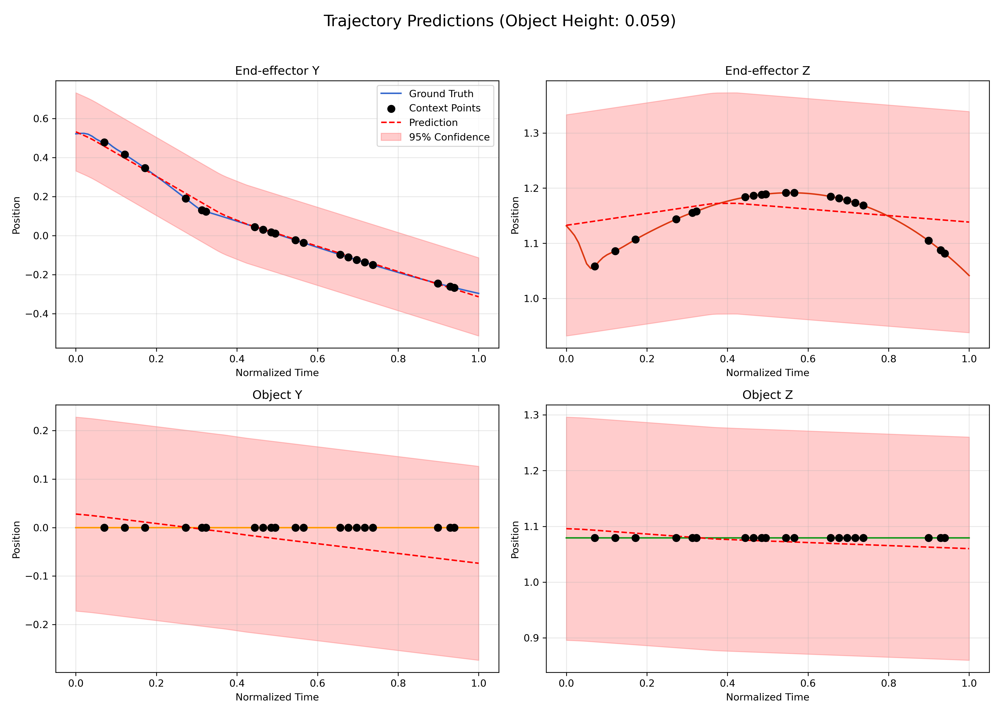

# Robot Trajectory Prediction with CNMP

- Trajectory Data:



## Training Process

The model was trained for 100 epochs with the following parameters:

- Batch size: 16
- Learning rate: 0.001
- Adam optimizer

During training, random subsets of each trajectory were used as context points, with varying numbers of context points (1-10) per batch.



## Results

The model was evaluated on 100 random test cases. MSE is used to measure performance.



## Prediction Visualization

The figure below shows model predictions for a sample trajectory:



## Usage

To run the code:

```bash
python homework4.py
```

This will generate trajectory data, train the model, evaluate performance, and create visualizations.
